

By Jessie Cappadonna

Version 1.2

## Contents
{:.no_toc}

- Will be replaced with the ToC, excluding the "Contents" header
{:toc}

---

Nature is complex, and often impacted by human encroachment. Ecologists work to understand ecosystem health and dynamics by employing a number of research techniques. Acoustic monitoring is one method of studying animals and habitat integrity.

-   Count the number of species in an area
-   Determine how many individuals of a species are in an area
-   Find secretive, camouflaged, and/or threatened species
-   Discover vocalisations and movement behaviours of species
-   Evaluate changes in animal acoustics after an environmental disturbance
-   Reveal acoustic patterns of a habitat over days, months, and years.

## 1) Sounds of Nature: Bioacoustics and Ecoacoustics

Nature is filled with complex and variable mosaics of acoustics. Morning is filled with the calls of birds, whereas night may be dominated by bat and frog calls. When fine-tuning your ear, you might 
notice that a single bird has a number of calls, but even a single call can vary each time it 
is made. This fine-scale variation may provide important information to animal listeners, but 
it often eludes human ears and understanding. Some bird species can mimic other species, 
and trick both humans and other animals, particularly when the caller cannot be seen. 
Much like people, many animal species also have regional differences in the ways they 
communicate. When scientists study calls of particular species, this is referred to as bioacoustics, whereas studying the acoustics of an entire ecosystem is referred to as ecoacoustics.

### 1.1) Recognising sounds

Computer recognition software can now automatically recognise patterns effectively in human 
speech. This type of software works well for people because it assumes there is relatively little to no 
background noise and that a person is close to the microphone resulting in a loud, clear, recording. 
Nature is different. Wild animals are generally not close to microphones. Acoustic data is often also plagued 
with background noises, such as weather events (e.g rain, wind, or thunder) and mechanical sounds (e.g. 
motorcycles or aeroplanes), which may drown out animal calls. Most animal calls are structured differently than 
the acoustic patterns of human vocalisations. All of these factors make human recognition software limited in 
effectiveness for identifying animal calls. To develop recognition software for even a single call of an 
animal species from natural recordings requires an significant amount of time, patience, and money. Even then 
such software can have limited accuracy.

### 1.2) Visualising acoustics

Animal calls in acoustic recordings can often be deciphered more accurately by people than by computers, 
especially when able to simultaneously visualise recordings. Acoustic vibrations can be visualise as a 
spectrogram, or graph of frequency over time. Standard spectrograms are often in grey-scale with the graphs and 
recordings being in sync, so that the acoustic events can be seen in a graph while being heard in the 
recordings. Animal calls that are loud and/or close to the microphones will show up darker in the spectrogram 
than calls that are softer or made further away from the microphones (Figure 1).

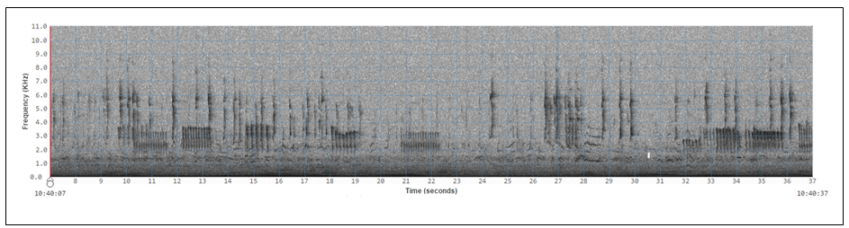

**Figure 1. This is an example of a standard grey-scale spectrogram, which is a visual representation of acoustic recordings as frequency over time. In this instance, the y-axis is frequency in kilohertz (1.0 to 11.0 kHz) and x-axis is time in seconds with a total of 30 seconds being shown. Dark shapes represent acoustic events such as animal calls. Variation in the darkness of shapes indicates differences in loudness. Animal call patterns, the caller's distance from the monitor, background noise, and other factors influence how well calls are picked up by the microphones.**

### 1.3) Measuring and seeing long-duration acoustic recordings

Reviewing acoustic data in real-time with audio and standard spectrograms takes quite a bit of time, so the Ecosounds lab has developed ways to evaluate acoustics of an environment more quickly. Mathematical formulas or algorithms known as acoustic indices can produce statistics that summarise sound vibrations, with each index being calculated based on different features of acoustics events. When multiple indices are graphed as acoustic frequency over time each index graphed often highlights a unique set of sounds with similar features. Colours are often assigned to each index so that acoustic events with similar features will be the same colour and easily distinguished from other acoustic events (Figure 2). In other words, one index may highlight sounds made by wind and rain, while another makes sounds of cricket or bird song more visible.

**Figure 2. This is an example of a long-duration spectrogram with false colour, which is a visual representation of acoustic recordings as frequency over time. In this instance, the y-axis is frequency in hertz (1,000 to 11,000 Hz) and x-axis is time compressed  from seconds to hours, with a total of 30 hours being shown. Three different indices of different colours are used in this example. In this case, acoustic events in green represent bird calls during the daylight hours, whereas acoustic events in pink and purple frequency ranges represent insects such as crickets calling during night hours.**

The timescale of the acoustic recordings can be compressed into hours, days, months, and even years, so that sound can be visualised much more quickly than 30 seconds at a time (compare Figures 1 & 2). Ecologists can quickly view these long-duration graphs to identify times of interest and inspect these periods of time more closely on association standard spectrograms. The long-duration graphs also allow people to recognise large-scale patterns in ecosystem sounds (ecoacoustics), which would likely otherwise go unnoticed. For example, graphs may show changes in ecoacoustics due to changes in animal activity, perhaps as a result of seasonal or habitat changes (e.g. human-caused or natural disturbances). 

Tools developed by the lab members are helping ecologists answer a wide variety of acoustic questions about ecoacoustics (e.g. comparing acoustics of different habitats) and particular species (e.g. koalas, frogs, and birds) from all kinds of habitats from desert and rainforests, to woodlands and urban environments. Be sure and visit the website periodically to see what new projects and tools have been developed. Anyone can all look through acoustic data using the tools on [www.ecosounds.org](www.ecosounds.org) to make ecological discoveries to understand and conserve species!

## 2) About the Ecosounds Lab

The Ecosounds lab in the QUT School of Electrical Engineering and Computer Science (EECS) is focused on computer science research to develop innovative ways to sample, analyse, and look at complex acoustic recordings that are created over days, months, and sometimes years from a wide variety of habitats. The website is one result of 
this research, and currently its primary purpose is to provide collaborating ecologists and citizens scientists with 
tools to view and assess acoustic data recorded from nature. As new methods are created, these new tools are 
integrated as time and funding allows. Check out the current suite of tools, and be sure and revisit the site regularly to find out what new tools have been added.

## 3) Registering & Joining a Project on Ecosounds.org

To check out what the site can do, go to <https://www.ecosounds.org/> and [Register](https://www.ecosounds.org/my_account/sign_up) by filling out your details to create an account (Figure 3).

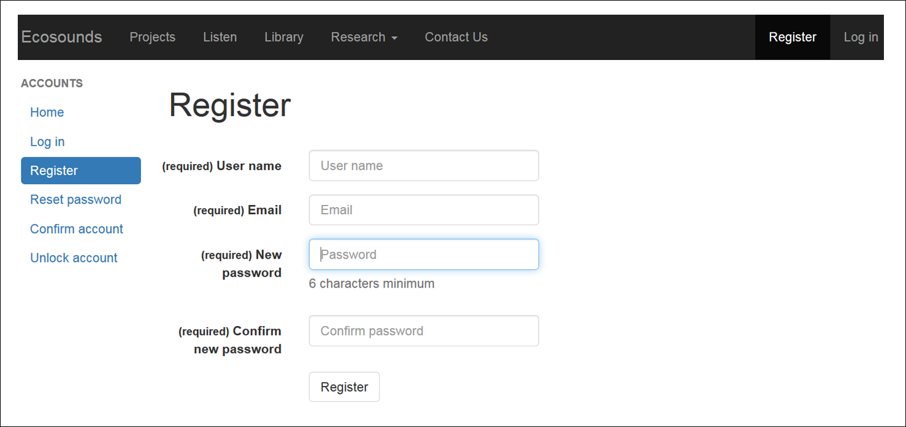

**Figure 3. A screenshot of the registration form page on Ecosounds.org.**

You will be reminded to confirm your registration, and can do so by checking your registered email (Figure 4).

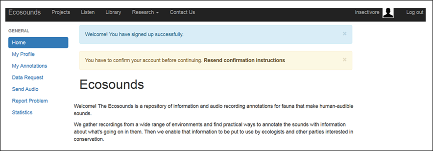

**Figure 4. A screenshot reminding the new registrant to confirm their account details via their registered email.**

Please note that you **_won’t have instant access_** to a project (Figure 5). 

**Figure 5. A screenshot of your project page immediately after registering, before being given access to a project within a day or two.**

After confirming your details, the webmaster will be notified that you have made an account, and **within a day or two** you will be given access to the lab's sample project that includes acoustic recordings from Oxley Creek (Figure 6). 

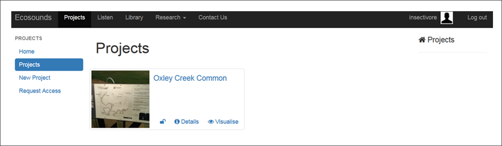

**Figure 6. A screenshot of your “Project Page” once you have been given access to the Oxley Creek project and received an email about project access.**

You will **_receive a welcome email_** when you have been given project access. If you are registering on the site to **_gain access to a specific project_**, you are welcome to “Request Access” via the link on the right-hand side of the projects page (Figure 5) and filling out the form (Figure 7). Note that, while all projects are listed on the “Request 
Access” page, most projects are active research projects led by an ecologist, and are not 
accessible to the public unless granted permission by this project leader. 

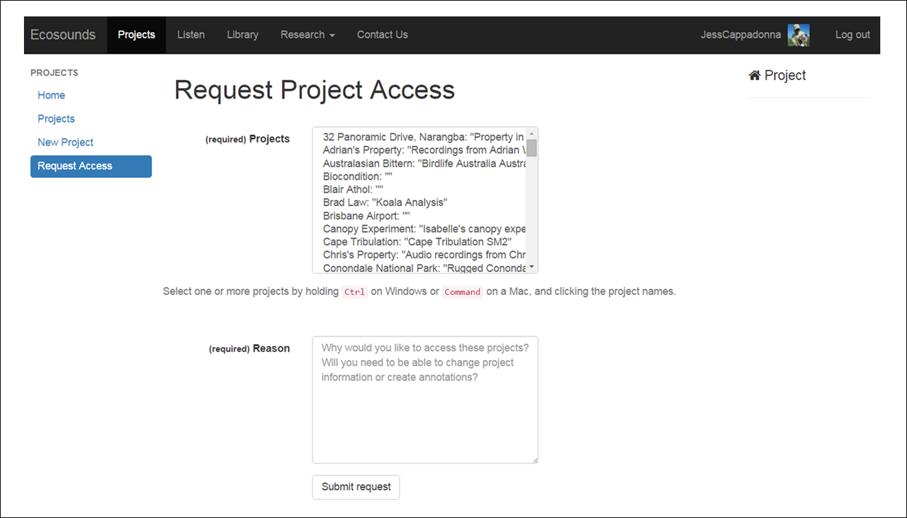

**Figure 7. A screenshot of the Request Access page.**

One project that anyone is welcome to join is the **Bristlebird Bioacoustics Bonanza** 
(Figure 8). 

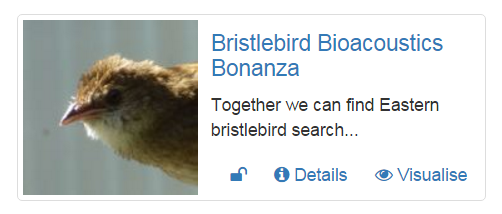

**Figure 8. A screenshot of the Bristlebird Bioacoustics Bonanza project icon.**

More citizen science projects are likely to be added to the site in the future too so keep in 
touch!

## 4) Exploring Projects

Before we jump into reviewing acoustic recordings, let me show you how to navigate the 
website, as well as how the website tools work! As discussed above, once you have registered, 
you will be given access to the Oxley Creek recordings (Figure 6). These project recordings 
are for you to have a play around with the website, and have a go at drawing boxes around 
sounds you see and hear in spectrograms (we call this *annotating*), as well as how to label 
(also known as to *tag*) boxes you create with information about the sound they contain.

More details about how to do all of this is given below, but once you have a feel for using 
the site, let us know if you are game to make discoveries from acoustic data by getting 
involved with an active project! One project you are welcome to **_request access_** to is 
**_Bristlebird Bioacoustics Bonanza_** (Figure 8)! Find out more about this exciting project 
in Section 5, but the website functionality descriptions below are based on this project as 
the exemplar citizen science project we expect most folks to be involved with.

In general, the Ecosound.org website displays information on both a project and site level. 
Most projects involve deployment of multiple acoustic monitors, and a site refers to the 
location an individual monitor is deployed. In the case of the **_Bristlebird Bioacoustics 
Bonanza_** project, one acoustic monitor was placed at the Currumbin Wildlife Sanctuary to 
record and learn the calls of the Eastern Bristlebirds. 

The Eastern Bristlebird Recovery Team has been searching for Eastern Bristlebird in Southeast Queensland for several years with very limited success. Amazingly there is a dog named Penny that has been trained to find Eastern Bristlebird by scent in New South Wales, and this year, this gorgeous springer spaniel joined the Queensland surveys (Figure 9). 



**Figure 9. Penny the conservation detector dog trained to find the scent of Eastern Bristlebird.**

During the surveys, Penny indicated picking up the scent of Eastern Bristlebird at two locations but birds were not seen by Penny's handlers, so four recorders were put at each site. Another site was thought by the team to be prime re estate, but vegetation was too think for even Penny to walk through, so four acoustic monitors were placed there as well, so a total of twelve recorders were placed in potential Eastern Bristlebird habitat (Figure 10). 

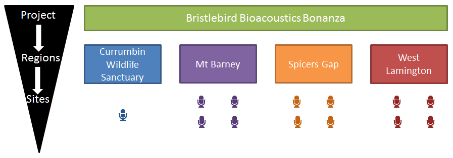

**Figure 10. A schematic of the Bristlebird Bioacoustics Bonanza project.**

In this case, the Eastern Bristlebird Recovery Team is targeting a small area in each region 
based on where Penny the detector dog indicated smelling bristlebird. Given the closeness of 
monitors within a region, there is a reasonable chance that if a bristlebird is heard in one 
monitor, the same call might be hear in another recording as well. This might help 
researchers figure out what direction the bird was headed. On the website you have the option 
of exploring “Details” or to “Visualise” information at both the project level and site level.

### 4.1) Project Navigation

When you are on the projects page, which shows what projects you have access to, you will see that each project has icons to "Visualise" or to read "Details" of the project (Figure 6).

**Figure 6. A screenshot of your “Projects” page once you have been given access to the Oxley Creek project and received an email about project access.**. 

When clicking on the "Details" icon at the project level you will be taken to a page with a description of the project, as well as project map and list of hyperlinks that take you to data from each microphone (referred to as "site" here; Figure 11). 

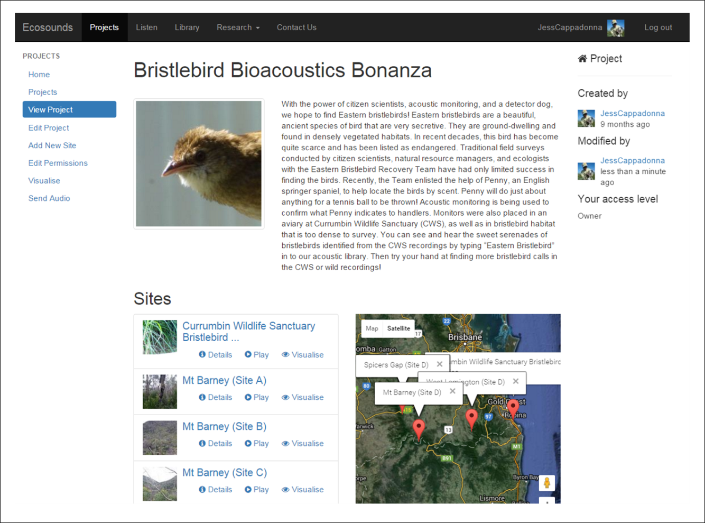

**Figure 11. A screenshot of the Bristlebird Bioacoustics Bonanza project “Details” page.**

Clicking on the "Visualise" link from the Projects page, by contrast, will provide you with a graphical display reflecting the recording dates and duration of recordings for each site (Figure 12a). When you click on a section of a site bar that site bar will expand, and zooming will be enabled to have a more refined view of the data (Figure 12b). If a long-duration spectrogram with false-colour has been generated for the site, this is visible at the bottom when the site bar above is clicked (Figure 12c).

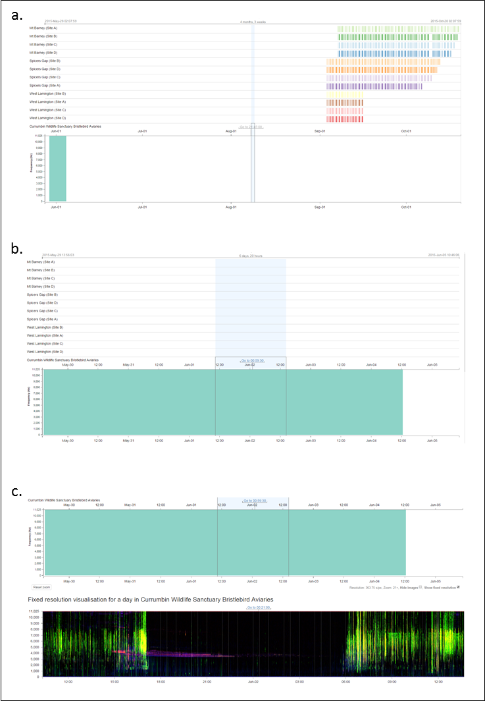

**Figure 12. A screenshot of the visualise page for the Bristlebird Bioacoustics Bonanza project, demonstrating the zooming functionality to review days and time data was recorded, as well as viewing the long-duration spectrogram when available for a particular site.**

_**Navigation tips**_: Zooming is a bit tricky to get the hang of at first, but with a bit of experimenting, you will get the hang of it! Similarly to how Google Maps can zoom to show different amounts of a map, you can zoom in and out to see different amounts of acoustic recordings - use the mouse wheel to zoom or pinch your mousepad or screen. You can shift the dates you're looking at by dragging your mouse or finger across the touchpad. If you click the “Go to” link, you will be taken to the 30 seconds of data at that location where you can "Play" the data, and zooming helps get to the specific segment of time you may want.

## 5) Exploring Sites of a Project

Site level pages can be easily accessed by clicking on the “Details” page for the project of interest and a list of sites for the project will be displayed (Figure 11). As with each project, there are “Detail” and “Visualise” pages for each site (Figures 13 & 14). 

A site “Details” page provides an overview of site information, including a list of recent activity in relation to drawing boxes around acoustic events and labeling the boxes on that site’s acoustic data (see “Recent Annotations”; Figure 13). 

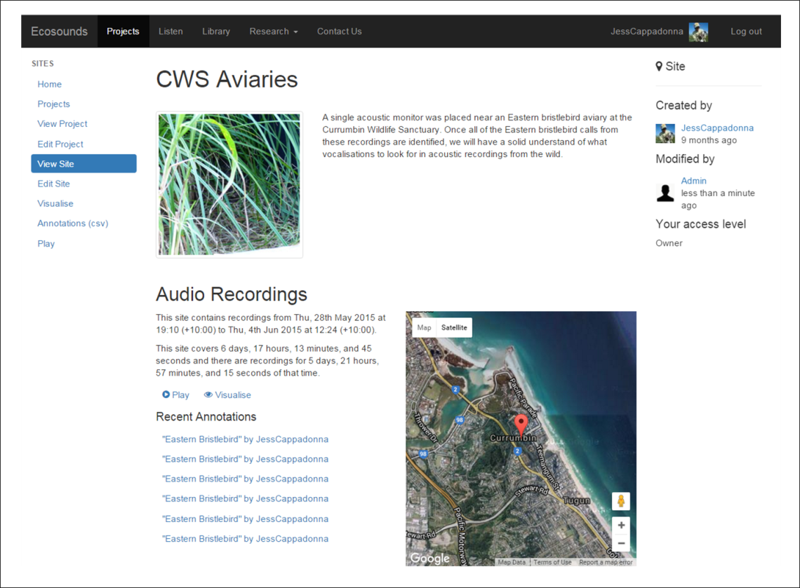

**Figure 13. A screenshot of a “Details” page for a site. Note that “Recent Annotations” refers to the most recent boxes drawn around acoustic events and associated labels.**

The _**site**_ “Visualise” pages work much like the _**project**_ visualise pages (see Section 4 for navigation tips), with the top bar having navigation capabilities (e.g. drag and zoom), and the bottom bar displaying the acoustic data as a long-duration spectrogram with false-colour for some sites (Figure 14). As with the project visualise page, you can navigate to a particular section of acoustic data you would like to listen to and click the "Go To" link to be taken to a page that allows you to listen to 30 seconds of sound and view the corresponding grey-scale spectrogram (Figure 14). In the lab, we call the page with the grey-scale spectrogram and the ability to play the acoustic recordings in 30 second segments the "Listen" page.

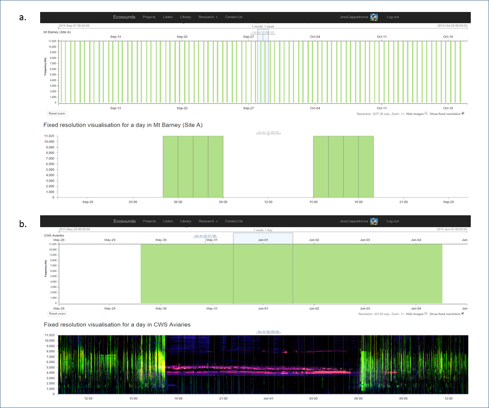

**Figure 14. Screenshots of a site "Visualise" page (a) zoomed out and without a longer-duration false-colour spectrogram generated, and (b) zoomed in with a longer-duration false-colour spectrogram generated.**

The Listen page is where you can search for an identify animal calls for research! Once you find an "acoustic event" of interest, such as a single call of your target species, you can draw a box around it, and then label the box with information about the acoustic event for future use by other citizen scientists and researchers.

### 5.1) How to Draw and Label a Perfect Annotation (Box) Around a Call!

Here are some pointers to help you draw the most useful box:

#### 5.1.1) Helpful Hints

1. _**Stop Playing**_: If the audio is playing, and you recognise a sound you would like to label, it might be easiest to stop the recording from playing so you have enough time. You can do this by clicking the “Pause/Play” icon (see blue circle; Figure 14a) or the “Autoplay” icon (see red circle; Figure 14a).

2. _**Drawing a Box**_: When you see and hear an event you recognise, it would be great it you could draw a box around it and label the box! To draw a box click and drag (this is easiest when using a mouse) on the spectrogram around one acoustic event at a time. Note the box may only capture a particular segment or syllable of a call if there is a clean break of 2 or more seconds between syllables (Figure 14b).

3. _**Tightening a Box**_: Draw the box tightly around the entire height and width of the sound, ensuring there is minimal empty space around the call/acoustic event. If the box is bigger then the event, you can "grab" and edge by clicking, holding, and dragging it. 

4. _**Label that Box**_: When the box is highlighted, the “Tag” field below the spectrogram is enabled so you can label the box, by typing the common name of the species in the “Tag” field (Figure 14b). 

5. _**Share What You Know by Labeling**_: You can add one, two, 
or more labels.

6. **_Finding an Unknown, Unexpected, or Bizarre Acoustic Event_**: Please label such events “unknown” so that it searched for via the acoustic library and reviewed by someone else. 

7. **_Getting an Acoustic Event Identification Verified_**: If you feel reasonably sure you know what something is but would like to have it checked, please add an "unsure" label.

8. **_Delete any Unlabeled Boxes_**: To do so, click the small black "X" in the top left-hand corner of the box.

8. **_When Done Labeling a Box_**: Just start drawing your next box or click the forward icon to move to the next 30 seconds. Your work will be saved automatically. 

#### 5.1.2) More Information is Better (Optional Labels)! 

1. **_Overlapping Acoustic Events_**: Generally, we only want one acoustic event per box, but it you would like to label a particular acoustic event that is overlapping with another, please add an "overlap label so that such tags can be easily sorted (Figure 14b).

2. Additional Information About Acoustic Events: Feel free to label acoustic events with additional information you know about the sounds. You may know, for example, a call was made in "response" to another animal, during a "conflict", by a "male", by a "female", or by a "juvenile". If you can't find the label you are looking for, you may suggest it via email or the contact page.

3. **What Does the Acoustic Event Look Like**: Does the shape of the call remind you of anything? Have a go at naming a call! We need your ideas for “looks-like” labels for calls, so we can distinguish 
between each call type. Eastern Bristlebirds, for example, have over 6 different call shapes 
(e.g. “check mark” or “flower-shaped”). The easier it is to describe and differentiate calls, 
the more information we can learn together!

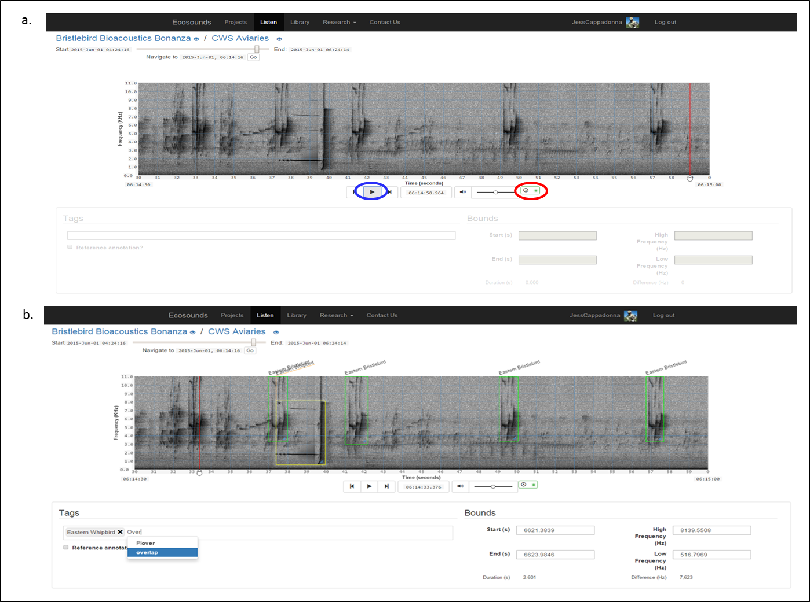

**Figure 14. A screenshot of an example “Play” page of a site.**

## Feedback

_I **welcome all feedback** no matter how big or small on these instructions and you experience using the website._

Things we are also interested to know include:

1. Species you would be interested in learning more about.
2. What ideas do you have for other information to include on Ecosounds.org ?
3. Do you have any different ideas on how to display acoustic recordings?
4. Are you interested in being part of citizen science research about acoustics?

Don’t be shy! Drop Jess Cappadonna a line at via the [contact us page](https://www.ecosounds.org/contact_us), [twitter](https://twitter.com/JessCappadonna), or direct email if you have it.

 &nbsp;

